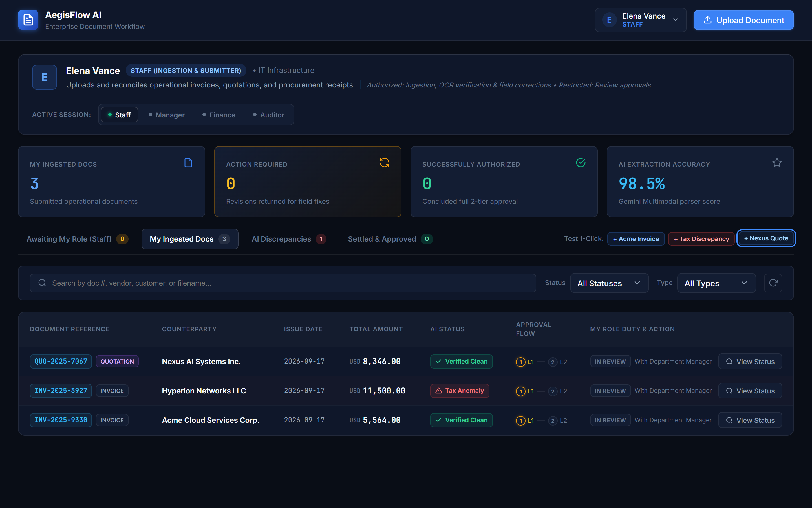
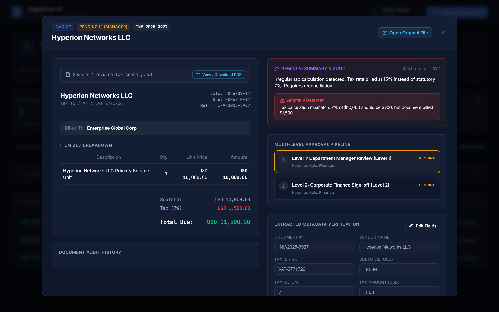
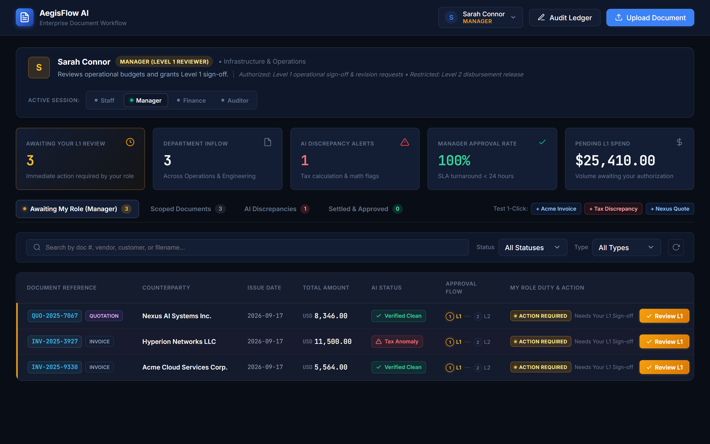
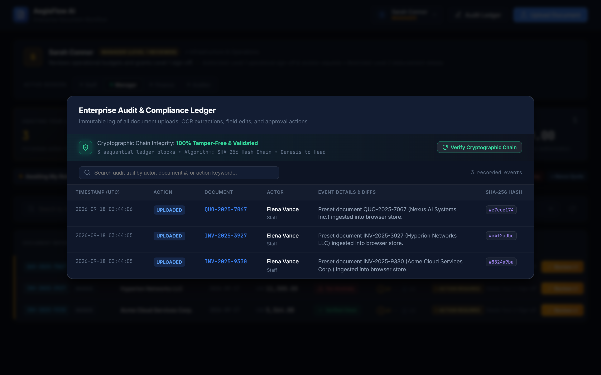
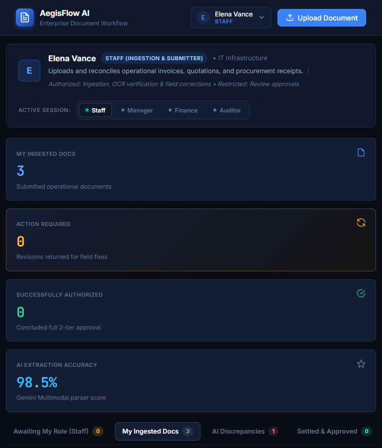
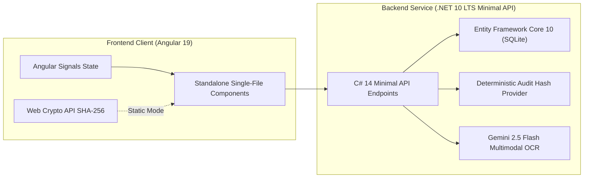
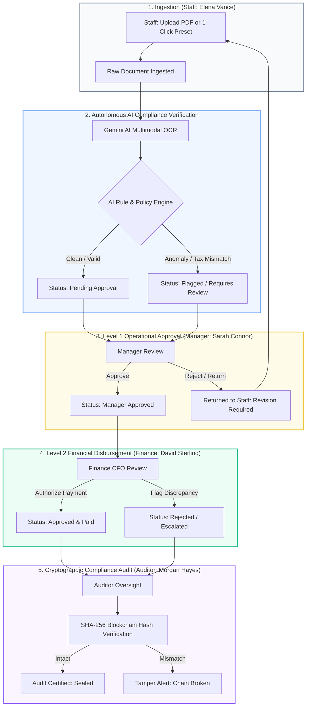
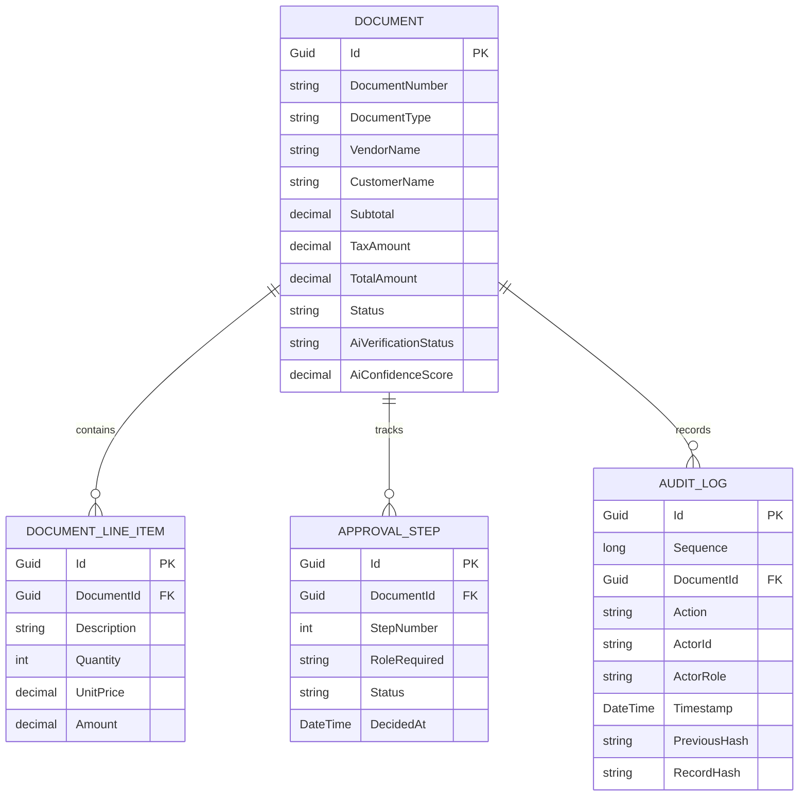

# AegisFlow AI: Intelligent Document Workflow & Cryptographic Segregation of Duties (SoD) Engine

[](https://zillerdx.github.io/ai-document-workflow/)
[-success?style=for-the-badge&logo=githubactions)](https://github.com/ZillerDX/ai-document-workflow/actions)
[](https://angular.dev/)
[](https://dotnet.microsoft.com/)
[](https://github.com/ZillerDX/ai-document-workflow)
[](https://developer.mozilla.org/en-US/docs/Web/API/Web_Crypto_API)
[](https://github.com/ZillerDX/ai-document-workflow)

> **🚀 Live Interactive Web Demo**: [https://zillerdx.github.io/ai-document-workflow/](https://zillerdx.github.io/ai-document-workflow/)
> 
> Enterprise-grade document lifecycle automation, multimodal AI compliance verification, and multi-tier approval system built with strict **Segregation of Duties (SoD)** and **tamper-evident SHA-256 cryptographic audit chaining**.

---

## 📸 Visual Showcase & Architectural Highlights

### 1. Executive Operations Dashboard & Clean Uniform Table (~52px)
High-density financial operations dashboard with real-time KPI metrics, role authority headers, smart queue tabs, and single-line 52px table rows.


---

### 2. Deep Multimodal AI Audit & "Open Original File" Modal
Itemized invoice breakdown, Gemini multimodal OCR extraction, tax calculation mismatch anomaly alert (15% billed vs 7% statutory), and direct access to open the original source PDF.


---

### 3. Strict Segregation of Duties (SoD) — Manager L1 Review View
When switched to Manager (Sarah Connor), the interface dynamically adapts with role boundaries, pending spend metrics ($25,410.00), and contextual `Action Required` / `Review L1` approval triggers.


---

### 4. Cryptographic Audit & Compliance Ledger (SHA-256 Hash Chain)
End-to-end forward-chained block ledger (`previousHash` $\to$ `recordHash`). Click "Verify Cryptographic Chain" to confirm 100% tamper-free integrity from genesis to head.


---

### 5. Defensive Responsive Design (Tablet Viewport 768px)
Fluid auto-wrapping KPI cards, clean typography, and horizontal scroll containment on compact displays.


---

## 🏛️ 7 Product Pillars (Portfolio-Grade Standard)

### 1. Who (Target Audience & Personas)
- **Accounts Payable & Operations Staff (Elena Vance)**: Submits operational invoices, quotes, and receipts. Has zero authorization to approve their own requests.
- **Department Managers (Sarah Connor)**: Validates line-item operational justifications and cost center allocations. Cannot authorize disbursement.
- **Corporate Finance / CFO (David Sterling)**: Releases payments and verifies tax withholdings. Cannot alter operational invoice content.
- **Internal & External Auditors (Morgan Hayes)**: Inspects compliance and cryptographically verifies the SHA-256 hash block chain against database tampering.

### 2. Problem (Real-World Enterprise Gaps)
- **Unauthorized Alterations & Invoice Fraud**: High-value invoice amounts altered between submission and payment release.
- **Lack of Strict Segregation of Duties (SoD)**: Single individuals creating, approving, and disbursing payments, leading to severe audit non-compliance.
- **Tax & Calculation Discrepancies**: Subtle overcharges or incorrect VAT/withholding tax rates slip past manual review.
- **Mutable & Non-Verifiable Audit Logs**: Traditional database log tables can be secretly modified or deleted via direct SQL queries without leaving evidence.

### 3. Solution (Value Proposition)
AegisFlow AI enforces an autonomous, end-to-end multi-tier pipeline:
1. **Multimodal OCR & AI Policy Engine**: Automatically extracts line items, validates subtotal/tax calculations, and flags anomalies before human review.
2. **Strict Dual-Tier Approval State Machine**: Segregated roles where users only see and act upon documents within their assigned authority.
3. **Cryptographically Sealed Audit Ledger**: Every mutation calculates a forward SHA-256 hash (`previousHash` + record data $\to$ `recordHash`). Any manual tampering immediately breaks the chain.
4. **Dual-Mode Engine**: Operates 100% autonomously in the browser via Web Crypto API on static hosting (GitHub Pages) or connects to the high-performance .NET 10 LTS Minimal API backend.

### 4. Core Features & Capabilities
- **Zero-Mock Clean State**: Boots ready for actual production documents with zero placeholder slop.
- **1-Click Business Presets**: Test clean invoices, tax discrepancies, or GPU hardware quotes instantly.
- **Equal-Height Table Rows (52px)**: Streamlined, single-line typography with all action buttons anchored to the same horizontal baseline.
- **Click-to-View Modal**: Clicking anywhere on a row opens the itemized modal with line-item breakdowns, AI confidence scores, and audit history.
- **"Open Original File" Viewer**: Direct access to view or download the uploaded source document or sample PDF in a new tab.
- **Responsive Design**: Defensive CSS layouts guaranteeing smooth scrolling and clean metric wrapping across desktop, tablet, and mobile.

### 5. Tech Stack & Architectural Rationale



- **Frontend**: Angular 19 (Standalone Single-File Components, Signals, Native Web Crypto API, Lucide Icons).
- **Backend**: .NET 10 LTS Minimal API, C# 14, Entity Framework Core 10, SQLite.
- **AI Engine**: Google Gemini 2.5 Flash Multimodal Vision & OCR.
- **Quality & Verification**: xUnit (.NET 10), Playwright Headless Visual Testing, GitHub Actions CI.

### 6. Architecture & Data Flow

#### Complete Document Lifecycle State Machine


#### Entity Relationship Diagram (ERD)


### 7. Interactive Demo & Sample Files

#### 📥 Download Sample Test Documents (PDFs)
Download these test files from GitHub or open them in your browser to test OCR extraction and discrepancy handling:

| Sample Document | Type | Amount | AI Evaluation Test Expectation | GitHub Direct Download | Live Hosted Link |
| :--- | :--- | :--- | :--- | :--- | :--- |
| **Sample 1: Clean Invoice** | `Invoice` | **$5,564.00** | ✅ **Clean Pass** (`Confidence: 99%`)<br>Valid subtotal and 7% statutory VAT | [⬇️ Download PDF](https://raw.githubusercontent.com/ZillerDX/ai-document-workflow/main/sample-documents/Sample_1_Invoice_Clean.pdf) | [📄 View PDF](https://zillerdx.github.io/ai-document-workflow/samples/Sample_1_Invoice_Clean.pdf) |
| **Sample 2: Tax Anomaly Invoice** | `Invoice` | **$11,500.00** | ⚠️ **Tax Anomaly Flagged** (`Confidence: 82%`)<br>Intentional mismatch ($500 VAT vs $700 calculated) | [⬇️ Download PDF](https://raw.githubusercontent.com/ZillerDX/ai-document-workflow/main/sample-documents/Sample_2_Invoice_Tax_Anomaly.pdf) | [📄 View PDF](https://zillerdx.github.io/ai-document-workflow/samples/Sample_2_Invoice_Tax_Anomaly.pdf) |
| **Sample 3: GPU Cluster Quotation** | `Quotation` | **$8,346.00** | ℹ️ **Valid Quotation** (`Confidence: 96%`)<br>Enterprise procurement hardware quote | [⬇️ Download PDF](https://raw.githubusercontent.com/ZillerDX/ai-document-workflow/main/sample-documents/Sample_3_Quotation_GPU_Cluster.pdf) | [📄 View PDF](https://zillerdx.github.io/ai-document-workflow/samples/Sample_3_Quotation_GPU_Cluster.pdf) |

---

## 👥 Role Matrix & Authority Boundaries

| Role | Persona | Scope & Authority | Permitted Actions |
| :--- | :--- | :--- | :--- |
| **Staff (Initiator)** | **Elena Vance**<br>`Systems Admin` | **Primary Entrypoint.** Can only view documents created by self or returned for correction. | • Upload Documents (PDF/PNG)<br>• Ingest Vendor Presets<br>• Correct & Resubmit field revisions |
| **Manager (L1)** | **Sarah Connor**<br>`Operations Director` | Views documents awaiting Level 1 operational approval or flagged by AI. Cannot pay invoices. | • Review Line-Item Justifications<br>• Approve for Level 2 Finance Review<br>• Reject / Request Revisions |
| **Finance (L2)** | **David Sterling**<br>`CFO` | Views manager-approved documents and tax anomaly queues. Cannot alter operational details. | • Inspect Tax ID & Withholdings<br>• Verify Vendor Bank Details<br>• Authorize & Release Payment |
| **Auditor** | **Morgan Hayes**<br>`Compliance Auditor` | Read-only oversight of all documents across the organization. | • Inspect Full Audit History<br>• Verify SHA-256 Chain Integrity<br>• Export Audit Summary |

---

## 🔒 Security & Cryptographic Integrity Guarantees

Each state mutation calculates a SHA-256 block hash adhering to:

$$\text{RecordHash} = \text{SHA-256}(\text{PreviousHash} \parallel \text{Timestamp} \parallel \text{DocId} \parallel \text{Action} \parallel \text{ActorRole} \parallel \text{Details})$$

- **Genesis Block**: Initiates with 64 zero characters (`000...000`).
- **Deterministic Sequencing**: Logs maintain an auto-incrementing `Sequence` key ensuring reproducible forward hashing across server restarts.
- **Tamper Alerting**: The Auditor's "Verify Integrity" routine inspects every block in sequence; modifying any historical record flags a cryptographic break immediately.

---

## 🛠️ REST API Specification (OpenAPI / Swagger)

When running in **Enterprise Backend Mode**, the .NET 10 LTS API exposes the following endpoints:

| Method | Endpoint | Description | Auth Scope |
| :--- | :--- | :--- | :--- |
| `GET` | `/api/documents` | Retrieve filtered documents based on role authority | All Personas |
| `GET` | `/api/documents/{id}` | Get complete document details with line items | Authorized Roles |
| `POST` | `/api/documents/upload` | Upload PDF/PNG document for Gemini OCR parsing | Staff Only |
| `POST` | `/api/documents/{id}/approve` | Approve document for current workflow step | Manager / Finance |
| `POST` | `/api/documents/{id}/reject` | Reject or return document for revision | Manager / Finance |
| `GET` | `/api/audit-logs` | Retrieve cryptographically chained audit history | Auditor |
| `POST` | `/api/audit-logs/verify` | Verify end-to-end SHA-256 blockchain integrity | Auditor |

---

## 🚀 Getting Started & Execution Guide

### Option 1: Live Web Demo (Zero Installation)
👉 **[https://zillerdx.github.io/ai-document-workflow/](https://zillerdx.github.io/ai-document-workflow/)**
1. App opens with Elena Vance (Staff) active.
2. Click **"+ Acme Invoice"** or upload a sample PDF to ingest a document.
3. Switch persona in the top-right header to **Manager (Sarah Connor)** to perform Level 1 approval.
4. Switch to **Finance (David Sterling)** to perform Level 2 payment release.
5. Switch to **Auditor (Morgan Hayes)** to verify the SHA-256 cryptographic chain integrity.

### Option 2: Local Development

#### Prerequisites
- Node.js 20+
- .NET 10 LTS SDK

#### 1. Frontend Client (Angular 19)
```powershell
cd frontend/client
npm install
npm start
# Available at http://localhost:4280 or http://localhost:4200
```

#### 2. Backend Service (.NET 10 LTS)
```powershell
cd backend/AiDocumentWorkflow.Api
dotnet restore
dotnet run
# API listens on http://localhost:5120
```

#### 3. Run Automated Tests (.NET xUnit)
```powershell
dotnet test backend/AiDocumentWorkflow.Tests --nologo -v q
# Result: Passed! Total: 7, Passed: 7, Failed: 0
```

### Option 3: Docker Container Orchestration
```powershell
# Build and run backend container
docker-compose up --build -d
# API is live at http://localhost:5120
```

---

## 📁 Repository Structure

```text
ai-document-workflow/
├── .github/
│   └── workflows/
│       └── ci.yml                      # Enterprise CI: Secret scan, .NET 10 LTS xUnit tests, Angular build
├── .gitignore                          # Excludes build outputs, local DBs, and private secrets
├── CONTEXT.md                          # Domain contracts, state transitions, and entity specifications
├── README.md                           # Master portfolio documentation (7 Product Pillars)
├── Dockerfile                          # Multi-stage hardened Alpine container for .NET API
├── docker-compose.yml                  # Local container orchestrator with persistent SQLite volume
│
├── docs/
│   └── assets/screenshots/             # High-DPI Visual Proofs (Hero Dashboard, Detail Modal, SoD View, Audit Ledger, Tablet)
│
├── sample-documents/                   # Standard test documents for verification & upload testing
│   ├── Sample_1_Invoice_Clean.pdf          # Clean standard invoice ($5,564.00, 100% math verified)
│   ├── Sample_2_Invoice_Tax_Anomaly.pdf    # Invoice with intentional tax anomaly ($11,500.00)
│   └── Sample_3_Quotation_GPU_Cluster.pdf  # Quotation for AI GPU cluster ($8,346.00)
│
├── frontend/
│   └── client/                         # Angular 19 Standalone Single-File Component Architecture
│       ├── angular.json                # Workspace build configuration (budgets, assets, baseHref)
│       ├── package.json                # Angular 19, Lucide Icons, TypeScript dependencies
│       ├── tsconfig.json               # Modern ES2022 TypeScript configuration
│       ├── serve-spa.js                # Local zero-dependency SPA preview server
│       ├── public/                     # Static browser assets & mirrored sample PDFs
│       │   └── samples/
│       └── src/
│           ├── index.html              # HTML5 root with font & icon preconnects
│           ├── main.ts                 # Standalone Angular application bootstrap
│           ├── styles.css              # Global design tokens and typography
│           └── app/
│               ├── models/document.model.ts       # Canonical TypeScript domain interfaces
│               ├── services/auth-persona.service.ts # Role switcher (Staff -> Manager -> Finance -> Auditor)
│               ├── services/browser-storage.service.ts # Native Web Crypto SHA-256 & localStorage engine
│               ├── services/document.service.ts   # Dual-mode delegator (Browser vs REST)
│               └── components/
│                   ├── dashboard/dashboard.component.ts      # Master Single-File Component
│                   ├── document-modal/document-modal.component.ts # Detail view & Original File Viewer
│                   ├── upload-modal/upload-modal.component.ts     # Document upload & preset selector
│                   └── audit-modal/audit-modal.component.ts       # Cryptographic chain inspector
│
└── backend/                            # .NET 10 LTS Minimal API Enterprise Service
    ├── Dockerfile                      # Multi-stage container definition
    ├── AiDocumentWorkflow.Api/
    │   ├── Program.cs                  # Minimal API bootstrap, OpenAPI, DI, and middleware
    │   ├── appsettings.json            # Base configuration
    │   ├── Controllers/                # REST endpoints (Documents, Workflow, Audit, Stats)
    │   ├── Data/AppDbContext.cs        # Entity Framework Core 10 SQLite context
    │   ├── Models/                     # Core Domain Entities (Document, ApprovalStep, AuditLog)
    │   └── Services/                   # Gemini AI Multimodal OCR & SHA-256 Hash Provider
    └── AiDocumentWorkflow.Tests/       # xUnit Automated Unit & Security Test Suite
        └── WorkflowEngineTests.cs      # Segregation of Duties & cryptographic tamper tests
```

---

## 📄 License
MIT License © 2026 Tanathon Chanapha (ZillerDX)
