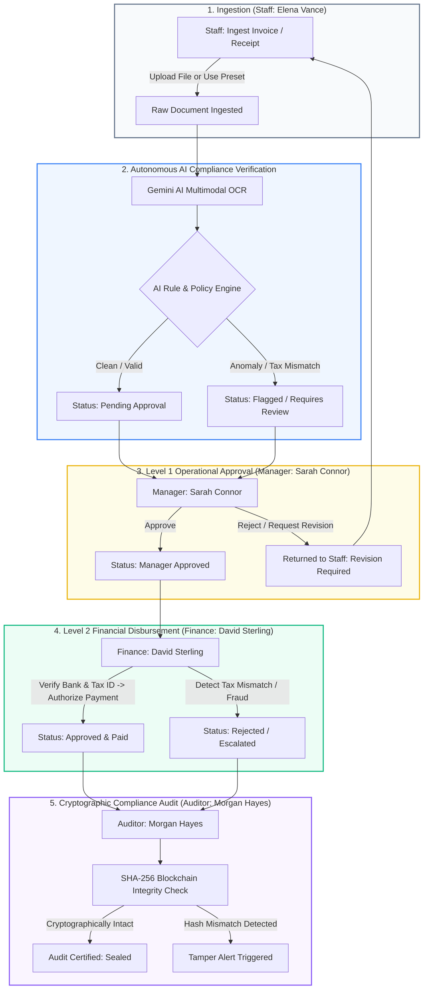

# AI-Powered Document Workflow & Segregation of Duties (SoD) Engine

[](https://zillerdx.github.io/ai-document-workflow/)
[](https://angular.dev/)
[](https://dotnet.microsoft.com/)
[](https://developer.mozilla.org/en-US/docs/Web/API/Web_Crypto_API)

> **Live Local & Cloud Preview**: [https://zillerdx.github.io/ai-document-workflow/](https://zillerdx.github.io/ai-document-workflow/)
> 
> Enterprise-grade document lifecycle, automated optical compliance verification, and multi-tier approval system built with strict Segregation of Duties (SoD) and cryptographically sealed audit logging.

---

## 🌟 Overview & Core Architecture

In high-compliance financial and enterprise environments, preventing unauthorized document tampering, invoice duplication, and fraud requires strict **Segregation of Duties (SoD)**. This system delivers an autonomous, end-to-end document intake, AI verification, and multi-level approval pipeline.

### Key Capabilities
1. **100% Zero-Mock, Browser-Persistent Storage**:
   - Boots with a clean, empty state (`[]`) ready for actual production data intake.
   - Powered by `BrowserStorageService` using browser `localStorage` + native **Web Crypto API (`window.crypto.subtle.digest`)**.
   - Generates immutable SHA-256 block hash chains (`previousHash` -> `hash`) directly in the browser, allowing 100% autonomous operation on static hosting platforms like GitHub Pages without requiring an active backend.
2. **Dual-Mode Engine (Static Browser Mode & .NET 9 Minimal API)**:
   - **Browser Mode (GitHub Pages)**: Client-side cryptographic ledger, full document lifecycle, inline presets, and instantaneous UI updates.
   - **Enterprise Mode (.NET 9 Minimal API)**: Lightweight, token-efficient REST backend with Entity Framework Core SQLite and Gemini Multimodal OCR integration.
3. **Strict Role Scoping & Segregation of Duties (SoD)**:
   - Users only see and interact with documents that fall within their designated legal/operational authority.
   - Action buttons and duty status badges are anchored on the **same horizontal baseline**, eliminating interface clutter and providing clear actionable feedback.
4. **Staff-First Initiation**:
   - Elena Vance (Staff) sits at the primary entry point of the workflow. Only Staff can ingest documents, upload invoices/receipts, or apply vendor presets.

---

## 🔄 Complete Document Lifecycle & Workflow



---

## 👥 Role Matrix & Segregation of Duties (SoD)

| Role | Persona | Permissions & Scope | Primary Actions |
| :--- | :--- | :--- | :--- |
| **Staff (Initiator)** | **Elena Vance**<br>`Systems Administrator`<br>`IT Infrastructure` | **First in sequence.** Can only view documents created by self and documents returned for revision. | • Upload Documents (PDF/PNG)<br>• Ingest Vendor Presets (Acme Cloud, Nexus AI, etc.)<br>• Correct & Resubmit revisions |
| **Manager (L1)** | **Sarah Connor**<br>`Operations Director`<br>`Infrastructure & Operations` | Sees documents awaiting Level 1 approval or flagged for managerial review. Cannot pay invoices. | • Review Line-Item Justification<br>• Approve for Finance Review<br>• Reject / Request Revision with comments |
| **Finance (L2)** | **David Sterling**<br>`Chief Financial Officer`<br>`Corporate Finance` | Sees manager-approved documents and tax anomaly queues. Cannot alter operational details. | • Inspect Tax ID & Withholding Tax<br>• Verify Vendor Bank Details<br>• Authorize & Release Payment |
| **Auditor** | **Morgan Hayes**<br>`Senior Compliance Auditor`<br>`Internal Audit & Governance` | Read-only oversight of all system documents. Authority to verify cryptographic chain integrity. | • Inspect Full Audit Trail<br>• Verify SHA-256 Chain Integrity<br>• Export Audit Summary |

---

## 📁 Detailed Project Tree

```text
ai-document-workflow/
├── .gitignore                          # Excludes build artifacts, secrets, and node_modules
├── CONTEXT.md                          # Domain architecture, state machine, and entity contracts
├── README.md                           # Comprehensive documentation and system guide
├── sample-documents/                   # Standard test documents for verification & upload testing
│   ├── Sample_1_Invoice_Clean.pdf          # Clean standard invoice ($5,564.00, 100% math verified)
│   ├── Sample_2_Invoice_Tax_Anomaly.pdf    # Invoice with intentional tax anomaly ($11,500.00)
│   └── Sample_3_Quotation_GPU_Cluster.pdf  # Quotation for AI GPU cluster ($8,346.00)
│
├── frontend/
│   └── client/                         # Angular 19 Standalone Single-File Component Architecture
│       ├── angular.json                # Workspace build configuration (budgets, assets, baseHref)
│       ├── package.json                # Angular 19, Lucide Icons, TypeScript dependencies
│       ├── tsconfig.json               # Modern ES2022 TypeScript configuration
│       ├── serve-spa.js                # Local zero-dependency SPA fallback preview server
│       ├── public/                     # Static browser assets
│       │   └── samples/                # Mirrored sample PDFs served statically on GitHub Pages
│       ├── dist/client/browser/        # Compiled static production bundle (deployed to GitHub Pages)
│       │   ├── index.html              # Main application entry point
│       │   ├── 404.html                # GitHub Pages SPA routing fallback (redirects to app router)
│       │   ├── main-*.js               # Compiled application logic & browser crypto storage
│       │   └── styles-*.css            # Compiled design tokens & utility styles
│       └── src/
│           ├── index.html              # HTML5 root with font & icon preconnects
│           ├── main.ts                 # Standalone Angular application bootstrap
│           ├── styles.css              # Global tokens, reset, scrollbar, and typography
│           └── app/
│               ├── app.component.ts    # Shell component hosting the Dashboard
│               ├── models/
│               │   └── document.model.ts   # Canonical TypeScript interfaces (Document, AuditLog, etc.)
│               ├── services/
│               │   ├── auth-persona.service.ts     # Role switcher (Staff -> Manager -> Finance -> Auditor)
│               │   ├── browser-storage.service.ts  # Native Web Crypto SHA-256 & localStorage engine
│               │   └── document.service.ts         # Unified interface delegating to browser/REST
│               └── components/
│                   └── dashboard/
│                       └── dashboard.component.ts  # Master Single-File Component with inline template/styles
│
└── backend/                            # .NET 9 Minimal API Enterprise Service (Optional Backend Mode)
    ├── backend.sln                     # Visual Studio / .NET solution file
    ├── AiDocumentWorkflow.Api/
    │   ├── Program.cs                  # 1-File Minimal API (Endpoints, Middleware, Gemini AI OCR Service)
    │   ├── appsettings.json            # Base application settings
    │   ├── AiDocumentWorkflow.Api.csproj
    │   ├── Models/                     # Core Domain Entities (Document, AuditTrail, Persona)
    │   └── Services/                   # Gemini AI Multimodal OCR & SHA-256 Ledger Provider
    └── AiDocumentWorkflow.Tests/       # xUnit Automated Unit & Security Test Suite
        ├── WorkflowSecurityTests.cs    # Segregation of Duties & tamper detection unit tests
        └── AiDocumentWorkflow.Tests.csproj
```

---

## 📥 Download Sample Test Documents (PDFs)

To test the end-to-end autonomous ingestion, OCR rule evaluation, and segregation of duties without needing your own files, download any of these 3 standard sample PDFs directly from GitHub or test them live in the app:

| Sample Document | Type | Amount | AI Evaluation Expectation | GitHub Direct Download Link | Live Hosted Link (GitHub Pages) |
| :--- | :--- | :--- | :--- | :--- | :--- |
| **Sample 1: Clean Invoice** | `Invoice` | **$5,564.00** | ✅ **Clean Pass** (`Confidence: 99%`)<br>Eligible for immediate Manager review | [⬇️ Download PDF](https://raw.githubusercontent.com/ZillerDX/ai-document-workflow/main/sample-documents/Sample_1_Invoice_Clean.pdf) | [📄 View in Browser](https://zillerdx.github.io/ai-document-workflow/samples/Sample_1_Invoice_Clean.pdf) |
| **Sample 2: Tax Anomaly Invoice** | `Invoice` | **$11,500.00** | ⚠️ **Tax Anomaly Flagged** (`Confidence: 82%`)<br>Intentional mismatch ($500 VAT vs $700 calculated) requires human review | [⬇️ Download PDF](https://raw.githubusercontent.com/ZillerDX/ai-document-workflow/main/sample-documents/Sample_2_Invoice_Tax_Anomaly.pdf) | [📄 View in Browser](https://zillerdx.github.io/ai-document-workflow/samples/Sample_2_Invoice_Tax_Anomaly.pdf) |
| **Sample 3: GPU Cluster Quotation** | `Quotation` | **$8,346.00** | ℹ️ **Valid Quotation** (`Confidence: 96%`)<br>Hardware procurement quote ready for departmental sign-off | [⬇️ Download PDF](https://raw.githubusercontent.com/ZillerDX/ai-document-workflow/main/sample-documents/Sample_3_Quotation_GPU_Cluster.pdf) | [📄 View in Browser](https://zillerdx.github.io/ai-document-workflow/samples/Sample_3_Quotation_GPU_Cluster.pdf) |

> [!TIP]
> **Quick Testing Flow**:
> 1. Download `Sample_2_Invoice_Tax_Anomaly.pdf`.
> 2. Open the [Live Web App](https://zillerdx.github.io/ai-document-workflow/).
> 3. As **Elena Vance (Staff)**, click **"Upload Document"** and upload the downloaded PDF file.
> 4. Notice the AI automatically flags the tax calculation mismatch in the table and modal!
> 5. Click the document row or **"View Details"** to inspect extracted items, and click **"Open Original File"** to view the PDF directly.

---

## 🚀 Getting Started

### 1. Live Browser Mode (Zero Installation)
Simply open the GitHub Pages deployment:
👉 **[https://zillerdx.github.io/ai-document-workflow/](https://zillerdx.github.io/ai-document-workflow/)**

- The app starts empty with **Zero Mock Data**.
- Elena Vance (Staff) is selected by default.
- Click **"Upload Document"** to load production invoices (e.g. Acme Cloud Services, Nexus AI, or custom PDF/PNG uploads).
- Switch personas in the top-right header to simulate the multi-tier approval process.
- All documents, revisions, and cryptographic audit chains persist in your browser's `localStorage`.

### 2. Local Development

#### Prerequisites
- Node.js 20+
- .NET 9 SDK (optional, for backend mode)

#### Running Frontend (Angular 19)
```powershell
cd frontend/client
npm install
npm start
# App is available at http://localhost:4280 or http://localhost:4200
```

#### Running Backend (.NET 9 Minimal API)
```powershell
cd backend/AiDocumentWorkflow.Api
dotnet restore
dotnet run
# API endpoints listen on http://localhost:5120
```

---

## 🔒 Security & Cryptographic Integrity

Each document update triggers an immutable audit log entry containing:
- Timestamp (UTC ISO 8601)
- Acting User & Role
- Action Taken (`Ingest`, `ApproveLevel1`, `ApproveLevel2`, `Reject`, `AuditCertify`)
- `previousHash`: The cryptographic hash of the preceding audit record
- `hash`: `SHA-256(previousHash + timestamp + action + actor + documentState)`

Any manual alteration to records in browser storage causes the Auditor's **"Verify Integrity"** routine to immediately flag a chain break, guaranteeing end-to-end tamper evidence.

---

## 📄 License
MIT License © 2026 Tanathon Chanapha (ZillerDX)
