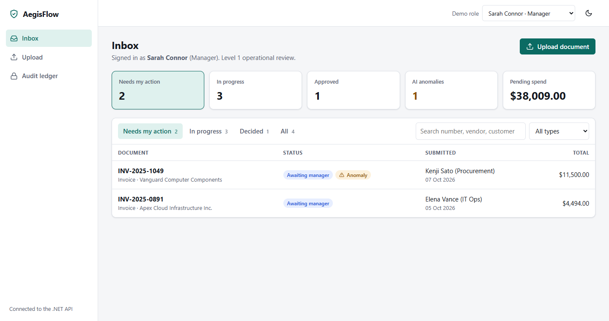
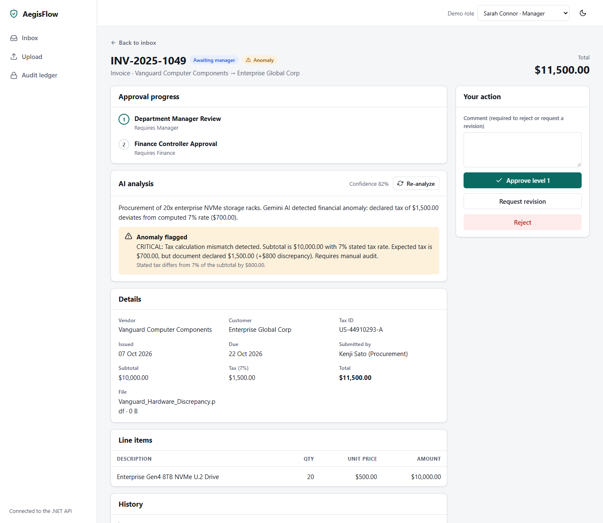
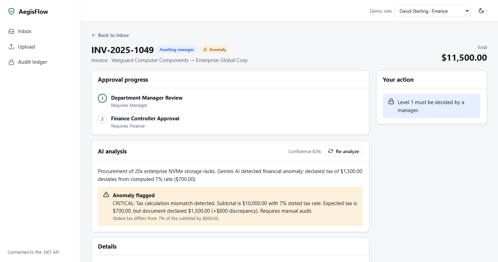
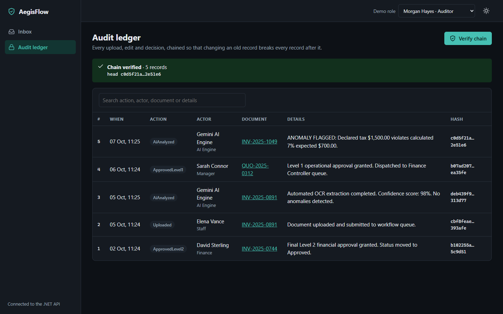
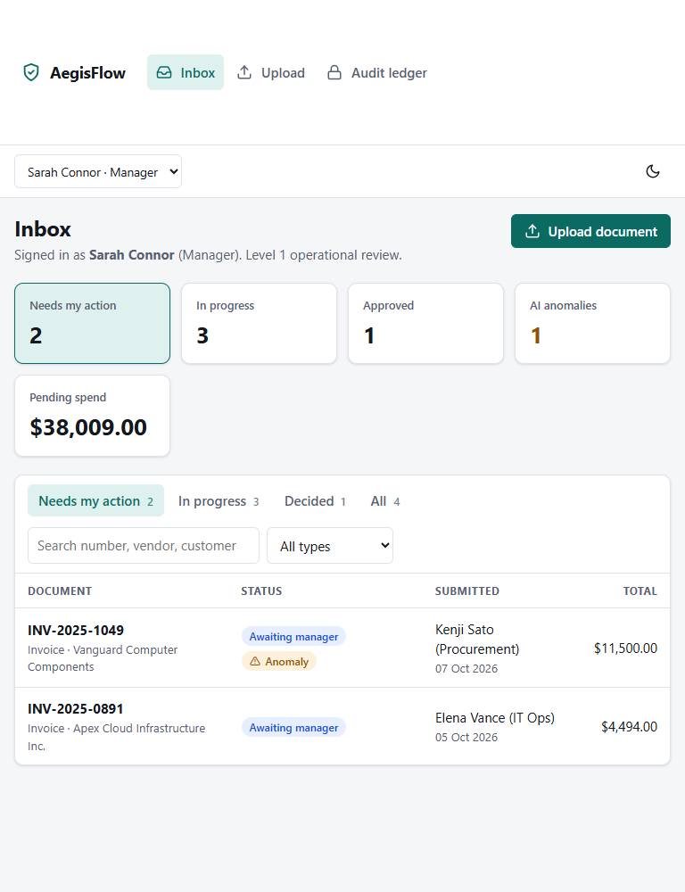
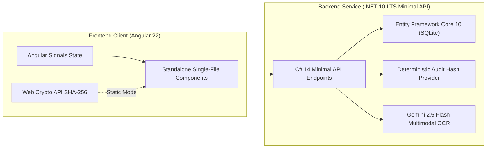
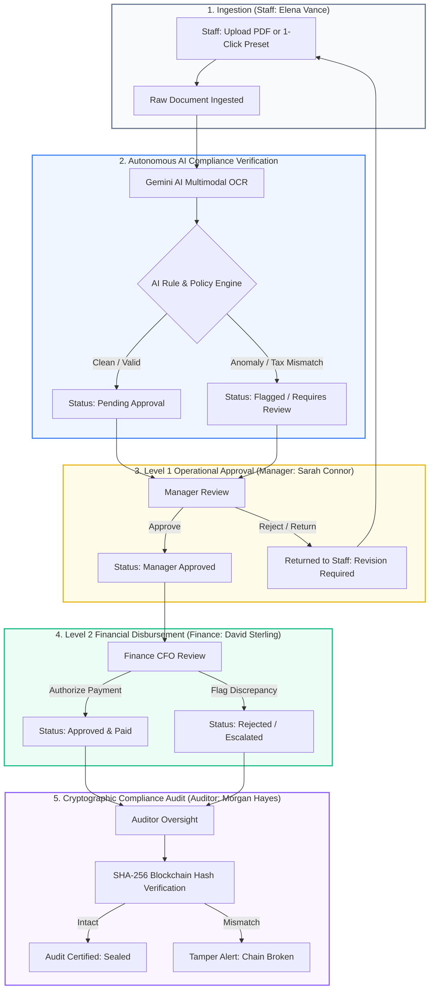
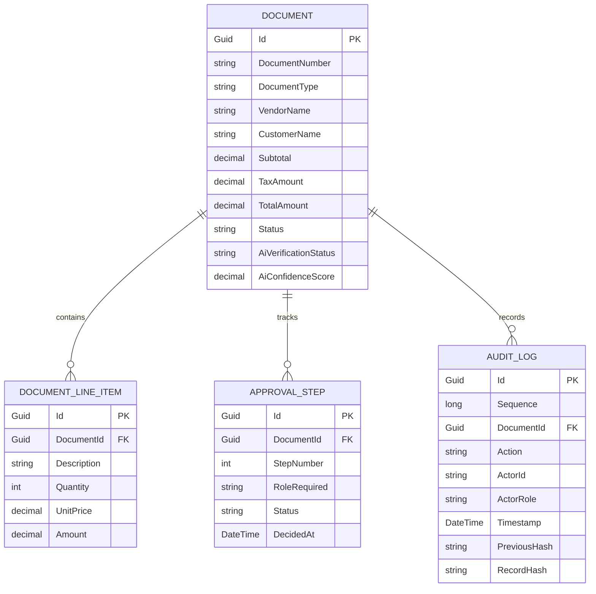

# AegisFlow AI: Intelligent Document Workflow & Cryptographic Segregation of Duties (SoD) Engine

[](https://zillerdx.github.io/ai-document-workflow/)
[-success?style=for-the-badge&logo=githubactions)](https://github.com/ZillerDX/ai-document-workflow/actions)
[](https://angular.dev/)
[](https://dotnet.microsoft.com/)
[](https://github.com/ZillerDX/ai-document-workflow)
[](https://developer.mozilla.org/en-US/docs/Web/API/Web_Crypto_API)
[](https://github.com/ZillerDX/ai-document-workflow)

> **🚀 Live Interactive Web Demo**: [https://zillerdx.github.io/ai-document-workflow/](https://zillerdx.github.io/ai-document-workflow/)
> 
> Enterprise-grade document lifecycle automation, multimodal AI compliance verification, and multi-tier approval system built with strict **Segregation of Duties (SoD)** and **SHA-256 hash-chained audit logging**. In .NET API mode the server derives identity from a signed token and owns the ledger; the static browser demo enforces the same rules client-side but its chain is only a demonstration (anyone controlling the browser can rewrite it).

---

## 📸 Visual Showcase & Architectural Highlights

### 1. Role-based inbox
The inbox opens on "Needs my action" for the current role, with compact KPIs, queue tabs, search and a type filter. Here: Manager (Sarah Connor) with two documents waiting for a Level 1 decision.


---

### 2. Document page with AI anomaly
One page per document: approval progress, AI analysis (the tax mismatch is flagged: 15% billed vs 7% statutory), details with inline correction, line items and history. The action panel on the right holds the decision.


---

### 3. Segregation of Duties explained in the UI
A user who may not act sees why instead of disabled buttons. Here: Finance (David Sterling) opens a document still waiting for Level 1. The server enforces the same rules, so the UI is a convenience, not the control.


---

### 4. Audit ledger and chain verification (dark theme)
Every upload, edit and decision is chained (`previousHash` to `recordHash`). Verifying walks the chain from genesis to head. In .NET API mode the server owns the ledger; the browser-only demo computes it client-side and shows a warning that it can be rewritten.


---

### 5. Defensive Responsive Design (Tablet Viewport 768px)
The shell collapses to a top bar and the content reflows without horizontal page scroll (also checked at 375px).


---

## 🏛️ 7 Product Pillars (Portfolio-Grade Standard)

### 1. Who (Target Audience & Personas)
- **Accounts Payable & Operations Staff (Elena Vance)**: Submits operational invoices, quotes, and receipts. Has zero authorization to approve their own requests.
- **Department Managers (Sarah Connor)**: Validates line-item operational justifications and cost center allocations. Cannot authorize disbursement.
- **Corporate Finance / CFO (David Sterling)**: Releases payments and verifies tax withholdings. Cannot alter operational invoice content.
- **Internal & External Auditors (Morgan Hayes)**: Inspects compliance and cryptographically verifies the SHA-256 hash block chain against database tampering.

### 2. Problem (Real-World Enterprise Gaps)
- **Unauthorized Alterations & Invoice Fraud**: High-value invoice amounts altered between submission and payment release.
- **Lack of Strict Segregation of Duties (SoD)**: Single individuals creating, approving, and disbursing payments, leading to severe audit non-compliance.
- **Tax & Calculation Discrepancies**: Subtle overcharges or incorrect VAT/withholding tax rates slip past manual review.
- **Mutable & Non-Verifiable Audit Logs**: Traditional database log tables can be secretly modified or deleted via direct SQL queries without leaving evidence.

### 3. Solution (Value Proposition)
AegisFlow AI enforces an autonomous, end-to-end multi-tier pipeline:
1. **Multimodal OCR & AI Policy Engine**: Automatically extracts line items, validates subtotal/tax calculations, and flags anomalies before human review.
2. **Strict Dual-Tier Approval State Machine**: Segregated roles where users only see and act upon documents within their assigned authority.
3. **Cryptographically Sealed Audit Ledger**: Every mutation calculates a forward SHA-256 hash (`previousHash` + record data $\to$ `recordHash`). Any manual tampering immediately breaks the chain.
4. **Dual-Mode Engine**: Operates 100% autonomously in the browser via Web Crypto API on static hosting (GitHub Pages) or connects to the high-performance .NET 10 LTS Minimal API backend.

### 4. Core Features & Capabilities
- **Light Mode Default with Instant Dark Toggle**: High-clarity Slate/White design tokens by default, toggleable to deep obsidian dark mode with zero layout shift and automatic `localStorage` persistence.
- **Zero-Mock Clean State**: Boots ready for actual production documents with zero placeholder slop.
- **1-Click Business Presets**: Test clean invoices, tax discrepancies, or GPU hardware quotes instantly.
- **Equal-Height Table Rows (52px)**: Streamlined, single-line typography with all action buttons anchored to the same horizontal baseline.
- **Click-to-View Modal**: Clicking anywhere on a row opens the itemized modal with line-item breakdowns, AI confidence scores, and audit history.
- **"Open Original File" Viewer**: Direct access to view or download the uploaded source document or sample PDF in a new tab.
- **Responsive Design**: Defensive CSS layouts guaranteeing smooth scrolling and clean metric wrapping across desktop, tablet, and mobile.

### 5. Tech Stack & Architectural Rationale


```mermaid
graph LR
    subgraph Frontend["Frontend Client (Angular 22)"]
        UI["Standalone Single-File Components"]
        SIG["Angular Signals State"]
        CRYPTO["Web Crypto API SHA-256"]
    end

    subgraph Backend["Backend Service (.NET 10 LTS Minimal API)"]
        API["C# 14 Minimal API Endpoints"]
        EF["Entity Framework Core 10 (SQLite)"]
        LEDGER["Deterministic Audit Hash Provider"]
        AI["Gemini 2.5 Flash Multimodal OCR"]
    end

    UI --> API
    SIG --> UI
    CRYPTO -.->|Static Mode| UI
    API --> EF
    API --> LEDGER
    API --> AI
```

- **Frontend**: Angular 22 (standalone components, signals, zoneless, lazy routes, Vitest, native Web Crypto API).
- **Backend**: .NET 10 LTS Minimal API, C# 14, Entity Framework Core 10, SQLite.
- **AI Engine**: Google Gemini 2.5 Flash Multimodal Vision & OCR.
- **Quality & Verification**: xUnit (.NET 10), Playwright Headless Visual Testing, GitHub Actions CI.

### 6. Architecture & Data Flow

#### Complete Document Lifecycle State Machine

```mermaid
flowchart TD
    subgraph S1["1. Ingestion (Staff: Elena Vance)"]
        A[Staff: Upload PDF or 1-Click Preset] --> B[Raw Document Ingested]
    end

    subgraph S2["2. Autonomous AI Compliance Verification"]
        B --> C[Gemini AI Multimodal OCR]
        C --> D{AI Rule & Policy Engine}
        D -->|Clean / Valid| E[Status: Pending Approval]
        D -->|Anomaly / Tax Mismatch| F[Status: Flagged / Requires Review]
    end

    subgraph S3["3. Level 1 Operational Approval (Manager: Sarah Connor)"]
        E --> G[Manager Review]
        F --> G
        G -->|Approve| H[Status: Manager Approved]
        G -->|Reject / Return| I[Returned to Staff: Revision Required]
        I --> A
    end

    subgraph S4["4. Level 2 Financial Disbursement (Finance: David Sterling)"]
        H --> J[Finance CFO Review]
        J -->|Authorize Payment| K[Status: Approved & Paid]
        J -->|Flag Discrepancy| L[Status: Rejected / Escalated]
    end

    subgraph S5["5. Cryptographic Compliance Audit (Auditor: Morgan Hayes)"]
        K --> M[Auditor Oversight]
        L --> M
        M --> N[SHA-256 Blockchain Hash Verification]
        N -->|Intact| O[Audit Certified: Sealed]
        N -->|Mismatch| P[Tamper Alert: Chain Broken]
    end

    style S1 fill:#f8fafc,stroke:#64748b,stroke-width:2px
    style S2 fill:#eff6ff,stroke:#3b82f6,stroke-width:2px
    style S3 fill:#fefce8,stroke:#eab308,stroke-width:2px
    style S4 fill:#ecfdf5,stroke:#10b981,stroke-width:2px
    style S5 fill:#faf5ff,stroke:#8b5cf6,stroke-width:2px
```

#### Entity Relationship Diagram (ERD)

```mermaid
erDiagram
    DOCUMENT ||--o{ DOCUMENT_LINE_ITEM : contains
    DOCUMENT ||--o{ APPROVAL_STEP : tracks
    DOCUMENT ||--o{ AUDIT_LOG : records

    DOCUMENT {
        Guid Id PK
        string DocumentNumber
        string DocumentType
        string VendorName
        string CustomerName
        decimal Subtotal
        decimal TaxAmount
        decimal TotalAmount
        string Status
        string AiVerificationStatus
        decimal AiConfidenceScore
    }

    DOCUMENT_LINE_ITEM {
        Guid Id PK
        Guid DocumentId FK
        string Description
        int Quantity
        decimal UnitPrice
        decimal Amount
    }

    APPROVAL_STEP {
        Guid Id PK
        Guid DocumentId FK
        int StepNumber
        string RoleRequired
        string Status
        DateTime DecidedAt
    }

    AUDIT_LOG {
        Guid Id PK
        long Sequence
        Guid DocumentId FK
        string Action
        string ActorId
        string ActorRole
        DateTime Timestamp
        string PreviousHash
        string RecordHash
    }
```

### 7. Interactive Demo & Sample Files

#### 📥 Download Sample Test Documents (PDFs)
Download these test files from GitHub or open them in your browser to test OCR extraction and discrepancy handling:

| Sample Document | Type | Amount | AI Evaluation Test Expectation | GitHub Direct Download | Live Hosted Link |
| :--- | :--- | :--- | :--- | :--- | :--- |
| **Sample 1: Clean Invoice** | `Invoice` | **$5,564.00** | ✅ **Clean Pass** (`Confidence: 99%`)<br>Valid subtotal and 7% statutory VAT | [⬇️ Download PDF](https://raw.githubusercontent.com/ZillerDX/ai-document-workflow/main/sample-documents/Sample_1_Invoice_Clean.pdf) | [📄 View PDF](https://zillerdx.github.io/ai-document-workflow/samples/Sample_1_Invoice_Clean.pdf) |
| **Sample 2: Tax Anomaly Invoice** | `Invoice` | **$11,500.00** | ⚠️ **Tax Anomaly Flagged** (`Confidence: 82%`)<br>Intentional mismatch ($500 VAT vs $700 calculated) | [⬇️ Download PDF](https://raw.githubusercontent.com/ZillerDX/ai-document-workflow/main/sample-documents/Sample_2_Invoice_Tax_Anomaly.pdf) | [📄 View PDF](https://zillerdx.github.io/ai-document-workflow/samples/Sample_2_Invoice_Tax_Anomaly.pdf) |
| **Sample 3: GPU Cluster Quotation** | `Quotation` | **$8,346.00** | ℹ️ **Valid Quotation** (`Confidence: 96%`)<br>Enterprise procurement hardware quote | [⬇️ Download PDF](https://raw.githubusercontent.com/ZillerDX/ai-document-workflow/main/sample-documents/Sample_3_Quotation_GPU_Cluster.pdf) | [📄 View PDF](https://zillerdx.github.io/ai-document-workflow/samples/Sample_3_Quotation_GPU_Cluster.pdf) |

---

## 👥 Role Matrix & Authority Boundaries

| Role | Persona | Scope & Authority | Permitted Actions |
| :--- | :--- | :--- | :--- |
| **Staff (Initiator)** | **Elena Vance**<br>`Systems Admin` | **Primary Entrypoint.** Can only view documents created by self or returned for correction. | • Upload Documents (PDF/PNG)<br>• Ingest Vendor Presets<br>• Correct & Resubmit field revisions |
| **Manager (L1)** | **Sarah Connor**<br>`Operations Director` | Views documents awaiting Level 1 operational approval or flagged by AI. Cannot pay invoices. | • Review Line-Item Justifications<br>• Approve for Level 2 Finance Review<br>• Reject / Request Revisions |
| **Finance (L2)** | **David Sterling**<br>`CFO` | Views manager-approved documents and tax anomaly queues. Cannot alter operational details. | • Inspect Tax ID & Withholdings<br>• Verify Vendor Bank Details<br>• Authorize & Release Payment |
| **Auditor** | **Morgan Hayes**<br>`Compliance Auditor` | Read-only oversight of all documents across the organization. | • Inspect Full Audit History<br>• Verify SHA-256 Chain Integrity<br>• Export Audit Summary |

---

## 🔒 Security & Cryptographic Integrity Guarantees

Each state mutation calculates a SHA-256 block hash adhering to:

$$\text{RecordHash} = \text{SHA-256}(\text{PreviousHash} \parallel \text{Timestamp} \parallel \text{DocId} \parallel \text{Action} \parallel \text{ActorRole} \parallel \text{Details})$$

- **Genesis Block**: Initiates with 64 zero characters (`000...000`).
- **Deterministic Sequencing**: Logs maintain an auto-incrementing `Sequence` key ensuring reproducible forward hashing across server restarts.
- **Tamper Alerting**: The Auditor's "Verify Integrity" routine inspects every block in sequence; modifying any historical record flags a cryptographic break immediately.

---

## 🛠️ REST API Specification (OpenAPI / Swagger)

When running in **Enterprise Backend Mode**, the .NET 10 LTS API exposes the following endpoints:

| Method | Endpoint | Description | Auth Scope |
| :--- | :--- | :--- | :--- |
| `GET` | `/api/documents` | Retrieve filtered documents based on role authority | All Personas |
| `GET` | `/api/documents/{id}` | Get complete document details with line items | Authorized Roles |
| `POST` | `/api/documents/upload` | Upload PDF/PNG document for Gemini OCR parsing | Staff Only |
| `POST` | `/api/documents/{id}/approve` | Approve document for current workflow step | Manager / Finance |
| `POST` | `/api/documents/{id}/reject` | Reject or return document for revision | Manager / Finance |
| `GET` | `/api/audit-logs` | Retrieve cryptographically chained audit history | Auditor |
| `POST` | `/api/audit-logs/verify` | Verify end-to-end SHA-256 blockchain integrity | Auditor |

---

## 🚀 Getting Started & Execution Guide

### Option 1: Live Web Demo (Zero Installation)
👉 **[https://zillerdx.github.io/ai-document-workflow/](https://zillerdx.github.io/ai-document-workflow/)**
1. App opens with Elena Vance (Staff) active.
2. Click **"+ Acme Invoice"** or upload a sample PDF to ingest a document.
3. Switch persona in the top-right header to **Manager (Sarah Connor)** to perform Level 1 approval.
4. Switch to **Finance (David Sterling)** to perform Level 2 payment release.
5. Switch to **Auditor (Morgan Hayes)** to verify the SHA-256 cryptographic chain integrity.

### Option 2: Local Development

#### Prerequisites
- Node.js 22.22+ or 24.15+
- .NET 10 LTS SDK

#### 1. Frontend Client (Angular 22)
```powershell
cd frontend/app
npm ci
npm start                                # browser-only demo, http://localhost:4200
npm start -- --configuration http        # talks to the .NET API at http://localhost:5120
npm test                                 # Vitest unit tests
```

#### 2. Backend Service (.NET 10 LTS)
```powershell
cd backend/AiDocumentWorkflow.Api
dotnet restore
dotnet run
# API listens on http://localhost:5120 (Development: demo login enabled, random per-run JWT key)
```

#### 3. Run Automated Tests (.NET xUnit)
```powershell
dotnet test backend/AiDocumentWorkflow.Tests --nologo -v q
# All xUnit tests pass (workflow rules, Segregation of Duties, audit chain, concurrency)
```

### Option 3: Docker Container Orchestration
```powershell
# Copy .env.example to .env and set AUTH_JWT_KEY (>= 32 chars) first
docker-compose up --build -d
# API is live at http://localhost:5120
```

### Security model (read before deploying)
- **Demo login is not authentication.** `POST /api/auth/demo-login` issues a JWT for one of four seeded personas so the role-based workflow can be demonstrated. Set `Auth__EnableDemoLogin=false` and put a real identity provider in front of the API before any real use.
- The API never trusts a role or user id from a request body; both come from the token. Staff uploads and corrects fields, Manager decides Level 1, Finance decides Level 2, Auditor is read-only.
- Segregation of duties is enforced server-side: the submitter cannot decide their own document and one person cannot decide both levels. Fields are locked once Level 1 is decided.
- `Auth__JwtKey` (>= 32 chars) must be set outside Development; CORS origins come from `Cors__AllowedOrigins`.
- Uploaded documents are sent to the Gemini API when `Gemini__ApiKey` is configured. Do not upload confidential files unless that is acceptable.
- The browser-only demo stores data in `localStorage` and enforces the same rules in the client. That is a convenience, not a security boundary.

---

## 📁 Repository Structure

```text
ai-document-workflow/
├── .github/
│   └── workflows/
│       └── ci.yml                      # CI: Secret scan, .NET 10 LTS xUnit tests, Angular 22 build + Vitest
├── .gitignore                          # Excludes build outputs, local DBs, and private secrets
├── CONTEXT.md                          # Domain contracts, state transitions, and entity specifications
├── README.md                           # Master portfolio documentation (7 Product Pillars)
├── Dockerfile                          # Multi-stage hardened Alpine container for .NET API
├── docker-compose.yml                  # Local container orchestrator with persistent SQLite volume
│
├── docs/
│   └── assets/screenshots/             # High-DPI Visual Proofs (Hero Dashboard, Detail Modal, SoD View, Audit Ledger, Tablet)
│
├── sample-documents/                   # Standard test documents for verification & upload testing
│   ├── Sample_1_Invoice_Clean.pdf          # Clean standard invoice ($5,564.00, 100% math verified)
│   ├── Sample_2_Invoice_Tax_Anomaly.pdf    # Invoice with intentional tax anomaly ($11,500.00)
│   └── Sample_3_Quotation_GPU_Cluster.pdf  # Quotation for AI GPU cluster ($8,346.00)
│
├── frontend/
│   └── app/                            # Angular 22 (standalone, signals, zoneless, Vitest)
│       ├── angular.json                # Build configs: default (browser mode), http (talks to the API)
│       ├── public/samples/             # Sample PDFs used by browser mode
│       └── src/app/
│           ├── core/                   # models, workflow rules (mirrors backend), session, API layer
│           │   ├── api/                # DocumentApi, BrowserDocumentApi (localStorage + Web Crypto), HttpDocumentApi
│           │   └── auth/               # demo personas, session (JWT in memory), interceptor
│           ├── layout/                 # shell: sidebar, role switcher, theme toggle
│           ├── shared/                 # icon, status badge, toasts, formatters
│           └── features/               # inbox | document (detail page) | upload | audit
│
└── backend/                            # .NET 10 LTS Minimal API Enterprise Service
    ├── Dockerfile                      # Multi-stage container definition
    ├── AiDocumentWorkflow.Api/
    │   ├── Program.cs                  # Minimal API bootstrap, OpenAPI, DI, and middleware
    │   ├── appsettings.json            # Base configuration
    │   ├── Auth/                       # Demo-login JWT (not production auth), actor claims
    │   ├── Controllers/                # REST endpoints (Auth, Documents, Workflow, Audit, Stats)
    │   ├── Data/AppDbContext.cs        # Entity Framework Core 10 SQLite context
    │   ├── Models/                     # Core Domain Entities (Document, ApprovalStep, AuditLog)
    │   └── Services/                   # Gemini AI Multimodal OCR & SHA-256 Hash Provider
    └── AiDocumentWorkflow.Tests/       # xUnit Automated Unit & Security Test Suite
        ├── WorkflowEngineTests.cs      # Approval state machine tests
        └── SecurityAndIntegrityTests.cs # SoD, locking, audit chain, concurrency, upload validation
```

---

## 📄 License
MIT License © 2026 Tanathon Chanapha (ZillerDX)
